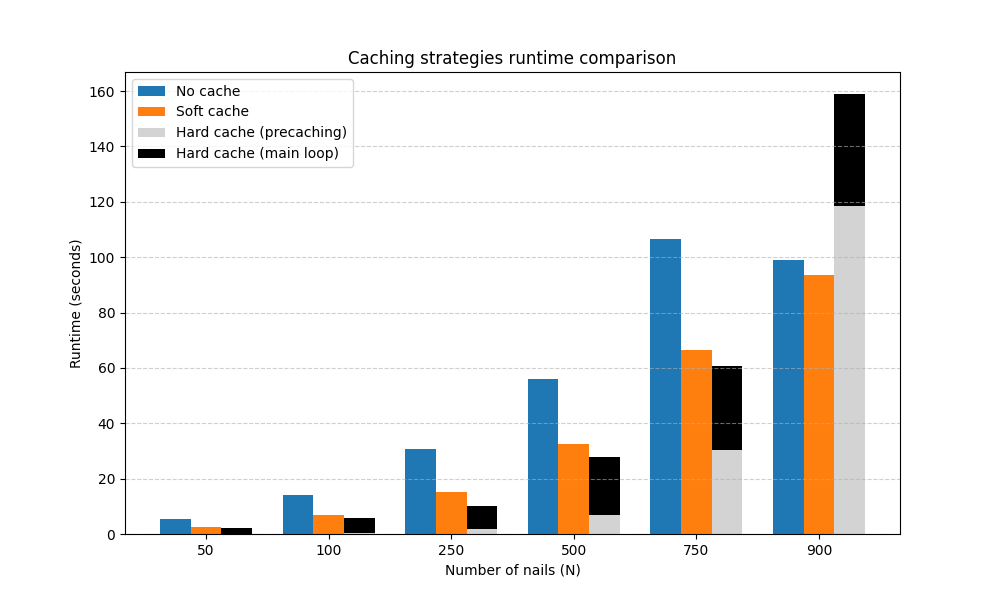

# Performance analysis: caching

## Why (pre)cache lines?
Preprocessing the input image and setting up the canvas is easy and done only once at the beginning; the expensive part of the algorithm is 
1. computing antialiased lines connecting any two nails;
2. choosing the best line in any given iteration by trying all possible lines starting from the current nail.

Given that the number of nails is fixed there is a finite number of possible pairs of nails, i.e. a finite number of possible antialiased lines.
Furthermore drawing a line on top of the current canvas simply means taking a linear combination of the arrays corresponding to the current canvas and the line, meaning this superposition is a simple linear operation. In code:
```
rr, cc, val = skimage.draw.line_aa(r0, c0, r1, c1)
new_canvas = current_canvas[rr, cc] - string_strength * val
new_canvas = np.clip(new_canvas, a_min=0, a_max=1)
```
where `r`/`c` stand for row/column coordinates, and `new_canvas` is the current state of canvas with the new line drawn/overlayed on top of it.

This suggest that if we precompute all possible lines (or at least save them after the first time they appear) we can essentially bypass step 1, thus only having to deal with the computational cost of step 2.

Due to the above three different versions of the main algorithm are available:
1. Recompute each line every time (no caching);
2. Compute each line only the first time it's needed, then save it in a database (soft caching);
3. Precompute all possible lines, setting them aside in a database, so that during the for loop no antialiasing is needed as we can simply look up lines from the database (hard caching).

It's reasonable to expect that in terms of computation time needed we would have 3>2>1; 3 also has the benefit that it allows us to get an accurate ETA right from the start (whereas with strategy 2 the ETA is initially overestimated as there are still lines that have to be cached at some point).
Despite this, there are at least two potential drawbacks of strategy 3 over 2 or 1:
- The number of pairs (hence lines) that can be made using $N$ objects is

$$
n_p = \binom{N}{2} = \frac{N!}{2!(N-2)!}
$$

meaning that the cache size scales factorially with $N$; hence we can expect that, if $N$ is too large, option 2 and 3 may actually crash because of unavailable memory. It's therefore important to check *for the relevant parameter value ranges* that strategy 3 is indeed the best one.

- Even if $n_p$ is manageable enough, one may wonder whether computing every possible line is actually useful in practice; maybe some lines are never used, thus adding a useless initial overhead in strategy 3. 
We can expect that this won't really be a concern in practice thanks to a) the `skip` function that prefilters lines that will probably never be used, and b) the fact that the algorithm needs a large amount of flexibility in order to "fit" the original image correctly, thus implying negligible probability that a significant fraction of unskipped lines is indeed useless. 
Still, it's better to actually check!

## $N$ scaling benchmark
Given the reasoning outlined above we can expect that, as long as $N$ is "small enough", we will see 3>2>1, i.e. hard caching better than soft caching, and soft caching better than no caching. 
In order to figure out what "small enough" means we can try running the three strategies on increasing values of $N$, keeping in mind that *in practice you typically want $N$ equal to a few hundred nails, but probably a few hundred below ~1000 at most*. This is because with too few nails the algorithm can only get a rough sketch of the input image, while with too many the image quickly becomes crowded and too dark (which can be partially compensated for by decreasing the string strength, but it's still better to look for a compromise between visual quality and performance anyway).

What we want to do, then, is to run the *StringArt* algorithm in its three different modes with the number of nails as a free parameter to be varied in the $[100, 1000]$ range, and measure the time needed to complete the task (in the case of strategy 3 we want to measure separately the time needed to precache and to run the main loop).
In order to get a realistic benchmark we will use one of the demo images (`einstein.jpg`) instead of e.g. an array of random white noise, with a large enough number of maximum iterations. For simplicity we will use a downscale factor that's a bit stronger than what one would probably used in practice given the resolution of that image (but still a realistic value).

## Benchmark results
By running `./caching_benchmark_script/caching_benchmark.py` we can benchmark how the factorially increasing cache size affects the time needed to compute the string art.
The default values used in the benchmark script are:
```
DOWNSCALE_FACTOR = 0.1
MAX_ITER = 3000
STRING_STRENGTH = 0.1
nails_list = [50, 100, 250, 500, 750, 900]
```
Please notice that for such large values of the number of nails at least 32 GB of (almost free) RAM may be needed, so if running the script locally you may want to tweak the parameter values.

The results are as follows:



```{include} caching_benchmark_script/benchmark_table.md
```

## Discussion
The above results nicely align with the intuition laid out in the introduction, allowing us to confirm some interesting points.

- Notice how the cache size grows extremely fast (factorially, i.e. even faster than exponentially) with the number of nails $N$. As long as $N$ isn't too large (about ~700 at most) the overhead due to the precaching isn't too significant, and actually it saves us much more time during the main loop than is lost due to caching, so it is indeed advantageous to use option 3.
- When $N$ crosses a certain threshold (whose specific value depends on the other parameters, but that is typically a few hundred less than ~1000) the number of possible lines explodes, which increases too much the initial overhead. Furthermore with so many lines in a confined space most of them won't indeed ever be used by the algorithm, which means it's a waste to actually compute all possible lines before needing them - in which case it's best to stick with soft caching.
- With 32 GB of RAM none of the strategies crashes; this suggests that values that are incompatible with caching are further than the ranges tested.
- In general we can conclude that given the recommended values for the number of nails (~150-400) and the other parameters, the best strategy is to use precaching, hence why it's on by default in all of *StringArt*'s interfaces. If values above ~500 are needed and/or not enough memory is available it then makes sense to try to disable precaching, and if it's still not enough soft caching as well.